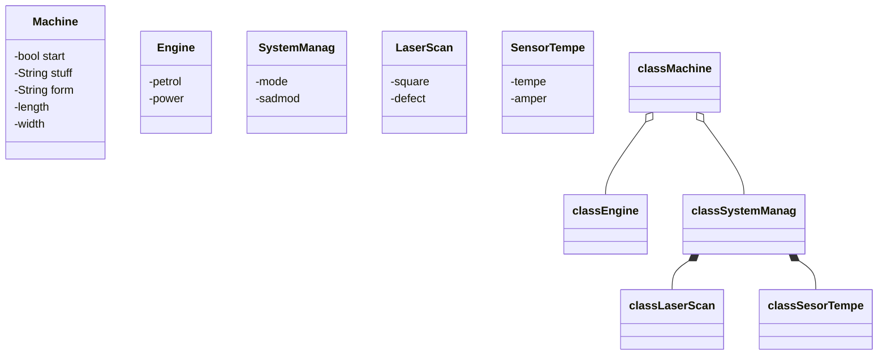

```mermaid
classDiagram
class Machine{
	-bool start
	-String stuff
	-String form
	-length
	-width
}
class Engine{
	-petrol
	-power
}
class SystemManag{
	-mode
	-sadmod
}
class LaserScan{
	-square
	-defect
}
class SensorTempe{
	-tempe
	-amper
}

classMachine o-- classEngine
classMachine o-- classSystemManag
classSystemManag *-- classLaserScan
classSystemManag *-- classSesorTempe
```